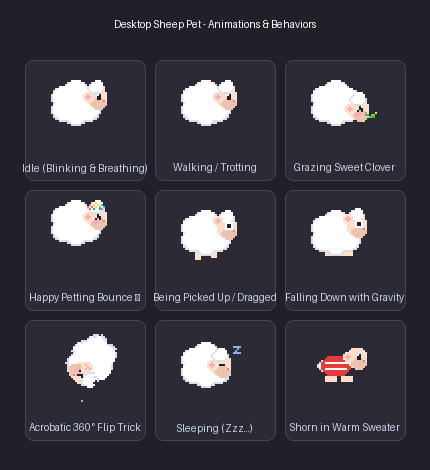
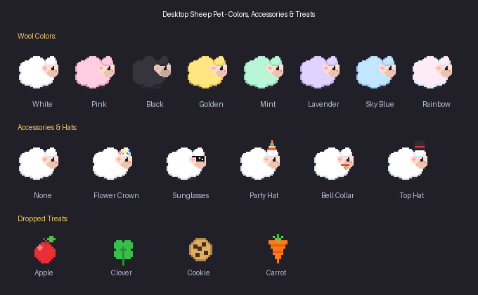

# 🐑 Desktop Animated Sheep Pet

An interactive, animated desktop sheep pet for Linux. Designed with procedural pixel art animations, realistic physics, sound effects, needs/Tamagotchi stats, and rich user interactions.




---

## ✨ Features

- **Charming Pixel Art Animations**:
  - **Idle**: Blinking eyes, gentle breathing wool fluff, tail wiggles.
  - **Walking / Trotting**: Smooth 6-frame trot cycle as it explores your screen.
  - **Grazing**: Nibbles on clover and grass with chewing animations and sweet flower pops.
  - **Happy Petting**: Bounces playfully with blushing cheeks and emits floating heart particles (`♥`).
  - **Being Picked Up / Dragged**: Comically kicks and pedals its little legs in mid-air with wide surprised eyes `(O.O)`.
  - **Falling with Gravity**: Bounces softly when hitting the desktop floor with a tiny dust puff.
  - **Acrobatic Tricks**: Performs full 360° somersault flips.
  - **Sleeping**: Curls into a snug woolly cloud ball with floating `Zzz` bubbles.
  - **Shearing & Sweaters**: Shear its overgrown wool to reveal a skinny sheep rocking a cozy red striped sweater! Its wool grows back over time.

- **Mouse Interactions**:
  - **Left-Click (Tap)**: Pet the sheep! Increases happiness and emits hearts and cheerful purr chimes.
  - **Click & Drag**: Pick the sheep up and move it anywhere on your desktop. Release or fling it in mid-air to see realistic gravity physics.
  - **Double-Click**: Command your sheep to do a somersault trick!
  - **Right-Click**: Opens a feature-packed context menu.

- **Feeding System**:
  - Drop treats onto your desktop:
    - 🍎 **Crisp Red Apple**
    - ☘ **Sweet 4-Leaf Clover**
    - 🍪 **Chocolate Cookie**
    - 🥕 **Crunchy Carrot**
  - The sheep detects the dropped food, trots over eagerly, and munches it up with sound effects and happiness boosts!

- **Customization & Accessories**:
  - **Wool Colors**: Classic White, Strawberry Pink, Midnight Black, Golden Honey Fleece, Matcha Mint, Lavender, Sky Cloud Blue, and Pastel Rainbow.
  - **Hats & Accessories**: Flower Crown, Cool Sunglasses, Party Hat, Bell Ribbon Collar, Dapper Top Hat.
  - **Personalities**:
    - *Free Wanderer*: Roams freely and grazes.
    - *Curious*: Follows your mouse cursor around the screen.
    - *Sleepyhead*: Loves napping frequently.
    - *Calm*: Stays in one spot.

- **Tamagotchi-style Pet Status Card**:
  - View real-time meters for **Happiness**, **Fullness**, **Energy**, and **Wool Fluffiness**.
  - One-click buttons to pet, feed, shear, or customize.

- **Multi-Pet Support (Herd Mode)**:
  - Spawn multiple sheep buddies that wander together on screen!

- **Desktop Integration**:
  - Runs in a lightweight, frameless, transparent overlay (`WA_TranslucentBackground`).
  - Bounded snugly around the sheep so your desktop icons and other application windows remain completely clickable.
  - Includes a desktop shortcut (`SheepPet.desktop`) on your desktop for 1-click launching.

---

## 🚀 Quick Start

### Launch via Desktop Icon
Double-click the **Desktop Sheep Pet** shortcut on your desktop.

### Launch via Terminal
```bash
cd /config/Desktop/test2
./launch_pet.sh
```

### Command Line Options
```bash
# Spawn with specific wool color and accessory
python3 main.py --color pink --accessory flower_crown --name "Bella"

# Spawn a herd of 4 sheep friends
python3 main.py --count 4

# Run with custom scale and muted audio
python3 main.py --scale 4 --no-sound
```

Available colors: `white`, `pink`, `black`, `golden`, `mint`, `lavender`, `sky_blue`, `rainbow`.  
Available accessories: `none`, `flower_crown`, `sunglasses`, `party_hat`, `bell_collar`, `top_hat`.

---

## 📂 Project Architecture

```
/config/Desktop/test2/
├── pet/
│   ├── __init__.py
│   ├── sprites.py       # Procedural pixel-art sprite engine & caching
│   ├── audio.py         # 8-bit sound synthesis (WAV) & QtMultimedia player
│   ├── food_item.py     # Interactive falling snack widgets
│   ├── sheep_widget.py  # Main pet window, physics, AI state machine & interactions
│   ├── dialogs.py       # Status card HUD, Style dialog, and Help guide
│   └── storage.py       # State & settings persistence (JSON)
├── main.py              # Application lifecycle, herd manager & CLI options
├── launch_pet.sh        # Bash runner script
├── test_pet.py          # Automated verification test suite
└── README.md            # Documentation
```
